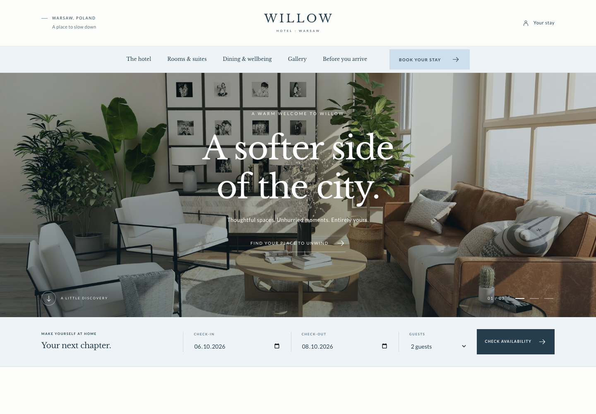

# WillowBooking

**A quieter kind of stay.**

A booking website for Willow, a fictional boutique hotel in Warsaw. Pastel blue tones, serif typography and smooth transitions create a calm setting for browsing rooms and planning a stay.

## Features

- Responsive design with an interactive photo gallery.
- Registration and sign-in with JWT authentication.
- Room availability search by dates and guest count.
- Reservations with automatic room assignment and price calculation.
- Personal booking history and cancellation.
- Protection against overlapping reservations for rooms and guest accounts.

## Built with

- **Frontend:** HTML, CSS, JavaScript, Jinja2
- **Backend:** Python, FastAPI
- **Database:** PostgreSQL, SQLAlchemy, Alembic
- **Tools:** Docker Compose, pytest, Playwright

*The hotel and its descriptions, services, room offerings and prices were invented by me. This project does not represent a real hotel
*Photography is sourced from Unsplash
